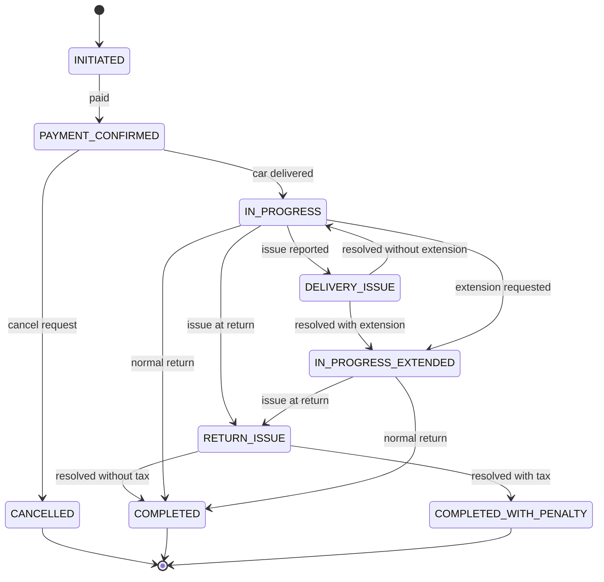
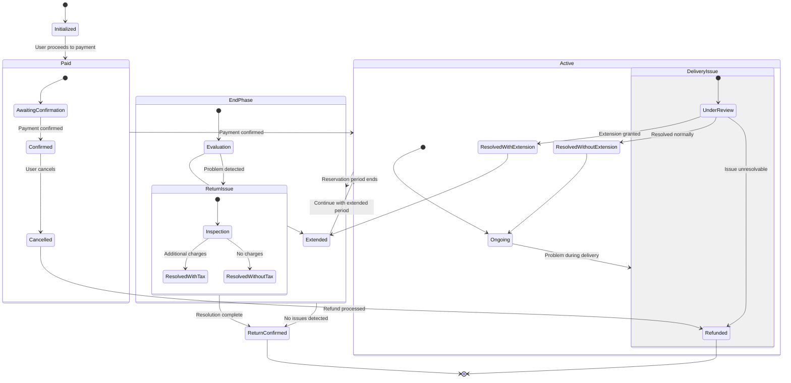

# Car rent Dz 
## Requirements and functionalities 
- [x] core system functionalities:
    - [ ] Geo-location system integration
    - [ ] User logs as stats
    - [ ] Realtime Notfification broadcasting,
    - [ ] User docs management
    - [ ] (not in contract) auto-Payment integration
    - [ ] (not in contract - new) referral system 
- [ ] particular user functionalities:
    - [ ] Auth options integration
    - [ ] Listing
         - [ ] Location based Listing
         - [ ] Agency profiles listing 
    - [ ] Promotions
         - [ ] by admin
         - [ ] by agency
    - [ ] Profile controll
    - [ ] Searching
        - [ ] by time range
        - [ ] by distance
        - [ ] price
        - [ ] rating
        - [ ] car-type
        - [ ] (notin contract) transmission type
    - [ ] Reservation management
        - [ ] base system with base flow 
        - [ ] (not in contract) price proposal -inDrive like feature
        - [ ] (not in contract) nssit bsah kanet option mliha 
    - [ ] (not in contract) wallet and withdrawal - deposit system
    - [ ] (not in contract) messaging system 
- [ ] Agency Owner
    - [ ] user Auth and profile
    - [ ] Main Dashboard with rich interface . including monthly revenu - idle/free - (not in contract) full month/week calander view   
    - [ ] base CRM
        - [ ] manage outbound customers 
        - [ ] manage inbound customers
        - [ ] customer booking documents management
        - [ ] customer-related documents management 
    - [ ] Fleet management
        - [ ] Categories-like feature
        - [ ] Vehicle meta-data options - including tarifs spent - hits number - rating - (not in contract) comments 
        - [ ] inMarket, inSite rules
        - [ ] inbound booking optons . including custom pricing 
        - [ ] outbound booking rules . including availability rules - dynamic pricing rules - cancellation rule - payment rules  
    - [ ] Payment management
        - [ ] withdrawal
        - [ ] inbound transactions
        - [ ] outbound transactions
        - [ ] system transactions
        - [ ] subscrptions/comissions 
        
- [ ] Admin - pseudo-admin
    - [ ] main dash
    - [ ] users management
        - [ ] (not in contract) users booking rules, per agency, per day, per week, overlap, cancellation penality, cancellation allowness, cancellation 
    - [ ] agencies management
    - [ ] payment management
        - [ ] payment method, approval, rules
        - [ ] payment flow, and so on
        - [ ] transactions of all kinds 
    - [ ] (not in contract) pseudo-admins with roles management 
    - [ ] (not in contract) support team system 
      
### Car Reservation Status Flow

---

### Detailed Reservation Flow

---

### defined rules 

```mermaid
flowchart TD
    subgraph "Admin-Defined Rules"
        A[Admin Sets Rules] --> B{Commission System?}
        B -->|Yes| C[Admin Defines Payment Rules for Each Agency]
        B -->|No| D[Agency Sets Own Payment Rules]
        
        C --> G[Admin-Defined Payment Rules]
        G --> G1[Payment Methods]
        G --> G2[Payment Approval Process]
        G --> G3[Transaction Fees]
        G --> G4[Withdrawal Rules]
        
        A --> E[Admin Sets Reservation Rules]
        E --> E1[Booking Limitations]
        E --> E2[Cancellation Policies]
        E --> E3[Penalties]
    end
    
    subgraph "Agency-Defined Rules"
        H[Agency Sets Rules] --> I[Agency Payment Rules]
        I --> I1[Custom Pricing]
        I --> I2[Payment Rules for Outbound Bookings]
        
        H --> J[Agency Reservation Rules]
        J --> J1[Availability Rules]
        J --> J2[Dynamic Pricing Rules]
        J --> J3[Cancellation Rules]
        J --> J4[Custom Payment Rules]
    end
    
    subgraph "Customer Booking Flow"
        K[Customer Makes Reservation] --> L{Meets Rules?}
        L -->|Yes| M[Reservation Confirmed]
        L -->|No| N[Reservation Rejected]
        
        M --> O{Payment Type?}
        O -->|Admin Defined| P[Follow Admin Payment Flow]
        O -->|Agency Defined| Q[Follow Agency Payment Flow]
        
        P --> R[Process Payment According to Admin Rules]
        Q --> S[Process Payment According to Agency Rules]
        
        R --> T[Complete Reservation]
        S --> T
    end
```

